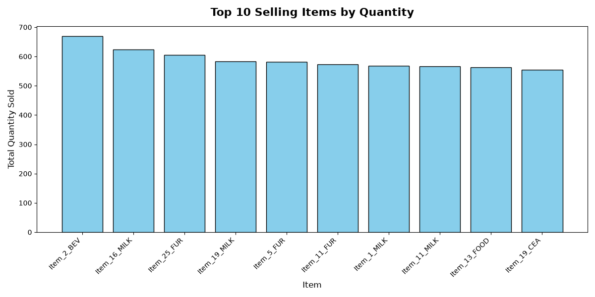
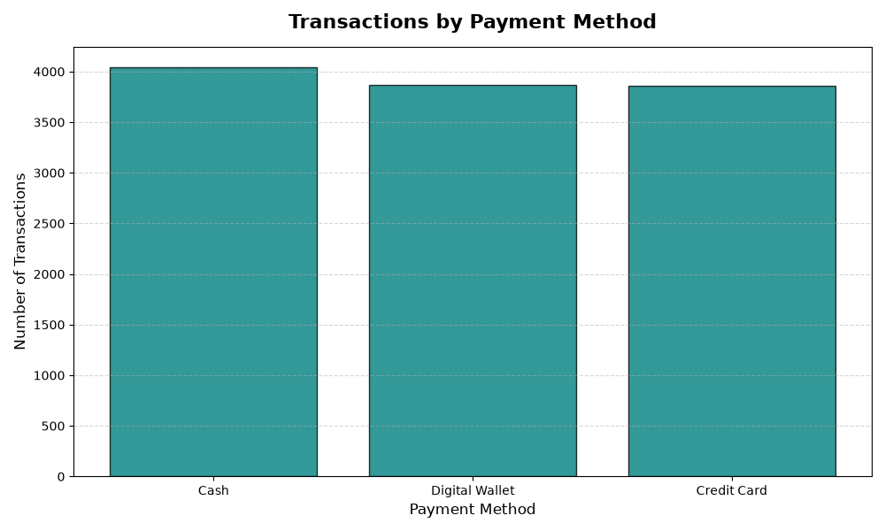
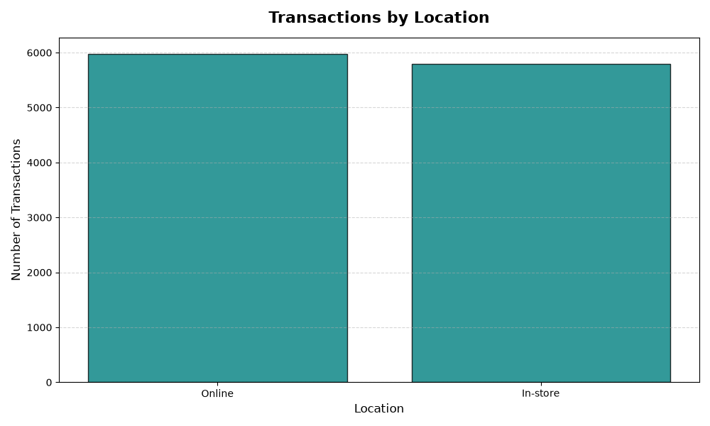
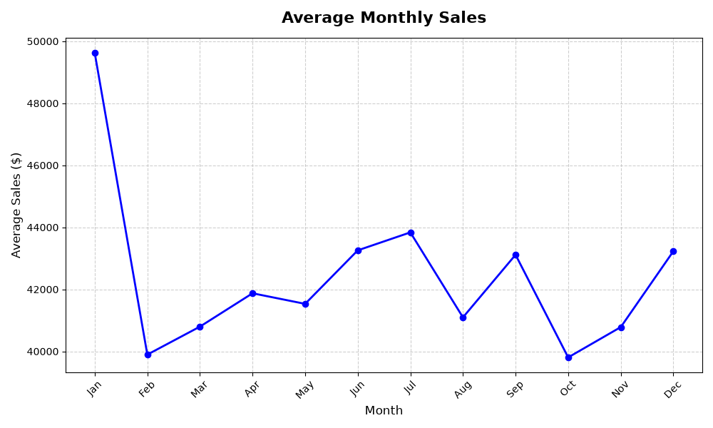

# Case Study: Automated Retail Sales Reporting with AI

An end to end pipeline combining data cleaning, statistical analysis, AI generated summaries, and live automation, built to demonstrate freelance ready data analytics and AI automation skills.

---

## The Problem

Small retail businesses generate transaction data constantly, but rarely have the time or tooling to turn it into actionable insight. This project simulates a real client engagement: given a raw retail sales export, build a system that not only analyzes the data once, but automatically re analyzes and reports on it every time new sales come in, with an AI written summary a business owner can actually read, not a spreadsheet they have to interpret themselves.

Deliverable: a live automation that watches a growing sales dataset, recalculates key metrics on any new activity, and delivers a written report via email and Slack, with zero manual steps after setup.

---

## Dataset

A retail point of sale export: roughly 12,575 transactions across 2022 through 2025, with columns for Transaction ID, Customer ID, Category, Item, Price Per Unit, Quantity, Total Spent, Payment Method, Location (Online or In store), Transaction Date, and Discount Applied.

The dataset was deliberately realistic rather than pre cleaned, messy in the ways real POS exports actually are: missing values, inconsistent types, and date format ambiguity.

---

## Part 1: Data Cleaning

Rather than dropping every incomplete row, each missing data problem was diagnosed individually and handled on its own merits:

* Price Per Unit, Quantity, and Total Spent (609 plus 604 rows affected): since Total Spent equals Price times Quantity, any row missing exactly one of the three was mathematically recoverable, so the missing value was derived rather than discarding the row. Only the 604 rows missing two or more fields were dropped, saving roughly 9.6 percent of the problem rows that a blanket drop and move on approach would have lost.
* Discount Applied (4,199 missing): defaulted to False, on the reasoning that a missing flag on a low stakes categorical field is a safer assumption than fabricating financial figures.
* Item (1,213 missing): explicitly labeled "Unknown" rather than guessed via category and price matching. I tested the matching approach conceptually and rejected it, since multiple items can share a category and price, making any guess unverifiable. An honest "Unknown" label costs almost nothing; a wrong guess erodes trust the moment it is caught.
* Transaction Date: converted to a proper datetime type, and this surfaced the project's first real bug, described below.

## Part 2: The Excel Date Bug

Early inspection of a few sample date values in Excel showed a month first style format such as 4/8/2024. The date parsing logic was built around that format, and it silently failed on the full dataset, converting every date to a null value with no error thrown.

Root cause: Excel was reformatting the display of the dates without changing the underlying data. The raw file, verified in a plain text editor, actually stored dates as year month day. This is a well known but easy to miss quirk of spreadsheet software, and it recurred a second time later in the project, in the n8n section, with Google Sheets doing something similar. The fix, and the lasting lesson: never trust a spreadsheet UI's display for raw data, always verify in plain text.

## Part 3: Business Analysis

Four core questions were answered, each with a deliberate choice of metric and honest interpretation of the result.

| Question | Finding |
|---|---|
| What sells most? | By unit volume, not revenue or transaction count, since revenue conflates price with popularity and transaction count ignores basket size. Top item: Item_2_BEV, 670 units, over the full validated 2022 through 2024 window. |
| Does discounting drive bigger purchases? | No meaningful effect. Average quantity per transaction was statistically flat, 5.54 versus 5.53 units, between discounted and non discounted transactions. |
| What is the preferred payment method? | No strong preference. Cash, Credit Card, and Digital Wallet were within about 2 percentage points of each other. |
| Online versus in store? | Also roughly balanced, about 51 percent online versus 49 percent in store. |

Three of four questions returned no strong signal, which is itself a legitimate, useful finding. It tells a business owner their customers behave consistently regardless of payment method or channel, rather than forcing a narrative that is not supported by the data.

The one genuine pattern: a seasonal analysis, average monthly revenue collapsed across all three years, showed January consistently peaking at roughly $49,600 versus a typical month of roughly $40,000 to $44,000. This was verified to hold in each of the three individual years, not just on the blended average, ruling out a single outlier year skewing the result.

## Part 4: AI Generated Reporting, and Why It Took Five Iterations

The core design principle: pre computed, verified numbers go to the AI; the AI only generates language, never math. This avoids the well documented risk of large language models calculating by pattern matching rather than executing real arithmetic.

Even with that principle in place, the first AI generated summary, despite having only correct, verified numbers, introduced two distinct interpretive failures uninvited by the prompt.

1. It labeled a real, completed year, 2024, as "projected" and "anticipated," implying a forecast that was never asked for.
2. It invented causal explanations, such as "strategies implemented... may have positively impacted performance," for patterns the data never explained.

Prompt hardening was iterative, not one shot. Each version closed one specific gap, and testing kept surfacing a new one.

* Version one to two: explicitly stated all years were historical fact, not forecasts. Fixed the projection labeling issue.
* Version two to three: added an instruction not to add speculative explanations. The AI complied for the revenue trend but still speculated about why January peaked.
* Version three to four: closed the loophole entirely, forbidding speculative explanations for trends at all, with no exceptions. A subtler issue then surfaced: the AI generalized "January was highest" into "the beginning of the year is generally strong," extrapolating scope beyond what was actually measured.
* Version four to five: moved from a free form paragraph to a constrained JSON schema with three separate, narrowly worded fields for top item, yearly revenue, and peak month. The first schema attempt over corrected into a bare data dump with no real sentence structure. Recalibrating each field's individual wording, removing redundant "no interpretation" phrasing that was suppressing language generation entirely, finally produced factual, readable, correctly scoped output.

Lesson for the case study: structured output formats constrain where content goes, but instruction wording still does the real work of constraining what gets said. Five iterations to get this right is a realistic, honest number, not a sign of failure.

## Part 5: Building the Live Automation with n8n

The final system uses a Google Sheet as a stand in for a live point of sale system, where a new sale means a new row. An n8n workflow watches this sheet and does the following:

1. Triggers on new rows added. Verified through live testing that the trigger only passes the new row itself, not the full history.
2. Fetches the entire current sheet on every run, since meaningful analysis such as top items and yearly trends requires full historical context, not just the newest transaction.
3. Runs five parallel aggregations, category totals, yearly revenue, monthly transaction averages, validated seasonality, and top item, using n8n's built in Summarize, Filter, Sort, and Limit nodes rather than pandas, since n8n's Code node sandbox blocks external Python packages entirely. This was a real constraint discovered through testing, not documentation.
4. Merges the five branches and reconstructs the JSON payload in JavaScript, translating the original Python logic.
5. Calls OpenAI with the hardened, schema constrained prompt.
6. Reformats and delivers the result via both email and Slack.

### Notable bugs resolved along the way

* A stale sheet reference: replacing the Google Sheet, in order to load the full dataset, silently broke the trigger, since Google assigns a new internal ID even when the visible sheet name is unchanged. Reselecting the sheet in the trigger's configuration fixed it.
* A real data integrity discovery: while chasing what looked like a Google Sheets import bug, where row counts did not match, the actual root cause turned out to be an unverified assumption made hours earlier, that 2025 only had one row of data, which was simply never checked with an actual count. The true number was 202 rows. This was traced back methodically by rebuilding the pipeline from scratch with checkpoints at every step, rather than guessing at fixes.
* AI output wrapped in markdown code fences: OpenAI's response included a json code fence around the JSON even when explicitly told to return only valid JSON. This is a known, common quirk that required defensive string cleaning before parsing.

---

## Reflections

What I would do differently with more time:

* Connect to a real business's live point of sale or e commerce API rather than a Google Sheet stand in.
* Build the discount versus category follow up analysis into the automated report, not just the manual one.
* Add a lightweight monitoring or alerting step so a failed AI call or empty dataset does not fail silently.

What this project demonstrates:

* Real, methodical data cleaning that recovers rather than discards data where possible.
* Statistical judgment, knowing when a difference is meaningful versus noise, and reporting honest null results rather than forcing a narrative.
* Practical, tested AI prompt engineering, including the discipline to keep testing after a prompt looks fixed.
* Working automation architecture across two different tool ecosystems, Python with pandas and n8n with JavaScript, with logic validated to match between them.
* A debugging habit of verifying claims with real checks rather than assumptions, which is what actually caught this project's most serious bug, the 2025 data miscount.

---

Built as a portfolio project to demonstrate data analytics and AI automation skills for freelance and consulting work.
